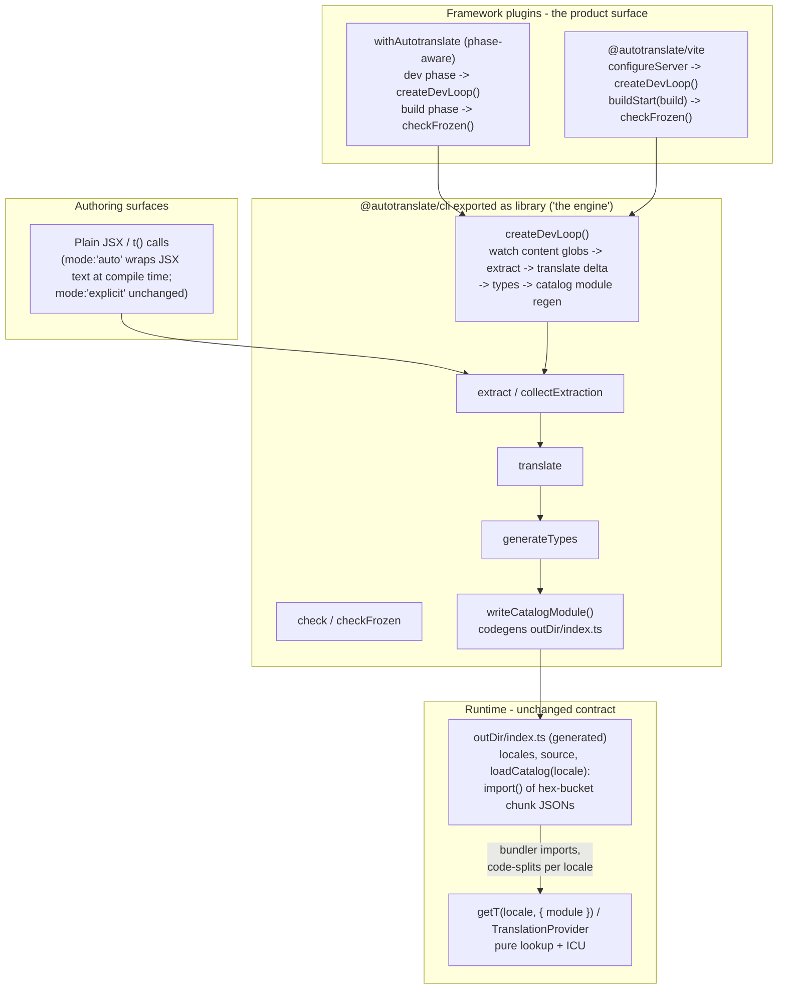
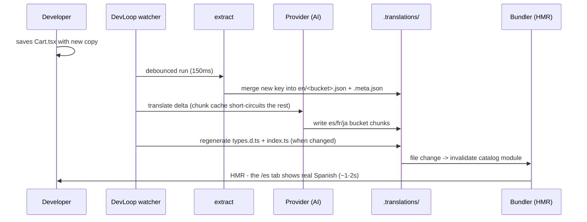
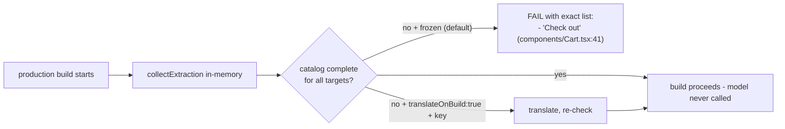

# Architecture mockup - "the plugin is the product"

End-state shape for Spec 001, as shipped.

## 1. Before / after

```
BEFORE (13 steps)                          AFTER (2 commands)
-----------------------------             -----------------------------
pnpm add @autotranslate/react              pnpm add @autotranslate/next   (or /vite)
pnpm add @autotranslate/core               npx autotranslate init
pnpm add -D @autotranslate/cli
pnpm add @autotranslate/next               ... then just write code.
edit autotranslate.config.ts               Dev: translations appear on save.
export ANTHROPIC_API_KEY                   Build: verifies catalog (never translates).
write proxy.ts                             CI: no API key needed.
wrap layout in TranslationProvider
wrap next.config in withAutotranslate
npx autotranslate extract
npx autotranslate translate
npx autotranslate generate-types
wire pnpm i18n into CI
```

## 2. Component shape



The runtime contract (`Translator`, `Catalog`, ICU, hash keys, `WIRE_FORMAT_VERSION = 2`) is untouched.
All changes are in delivery (how catalogs reach the runtime) and orchestration (who runs the pipeline).

## 3. The generated catalog module

```ts
// .translations/index.ts - GENERATED by autotranslate. Do not edit.
import type { Catalog, Locale } from '@autotranslate/core';

export const source = 'en' as const;
export const locales = ['en', 'es', 'fr', 'ja'] as const;

const chunks: Record<string, ReadonlyArray<() => Promise<{ default: Catalog }>>> = {
  en: [() => import('./en/0.json'), () => import('./en/3.json')],
  es: [() => import('./es/0.json'), () => import('./es/3.json')],
};

export async function loadCatalog(locale: Locale): Promise<Catalog> {
  const parts = await Promise.all((chunks[locale] ?? []).map((load) => load()));
  return Object.assign({}, ...parts.map((m) => m.default));
}
```

Consumption: `import * as catalogModule from '../../.translations'` then `getT(lang, { module: catalogModule })`.
Real module + static `import()` = bundler code-splits per locale, edge-safe, no runtime fs, no tracing config.

## 4. Dev loop sequence



Debounced saves, serialized runs with one trailing queued run, provider errors surface as events - the loop never crashes the dev server.

## 5. Frozen build



Config: `build: { frozen: true, translateOnBuild: false }`.
Absent catalog (fresh project, examples in CI) passes with `catalogAbsent: true`.

## 6. Auto mode

One classifier (`@autotranslate/core/classifier`, versioned via `CLASSIFIER_VERSION`), three consumers: the transform, the extractor (which pipes source through the same transform, so keys agree by construction), and the eslint rule.

```tsx
// author writes                          // compiler emits (mode:'auto')
<p>Hello {user.name}, welcome</p>   ->    <p><T>Hello <Var>{user.name}</Var>, welcome</T></p>
<p>Hi <strong>there</strong> friend</p> -> <p><T>Hi <strong>there</strong> friend</T></p>
<p data-no-translate>SKU-{id}</p>   ->    (unchanged)
```

Run model: maximal contiguous sequences of text / static strings / dynamic expressions (`<Var>`) / clean child elements.
Non-clean children (markers, skip elements, `data-no-translate`, JSX-bearing expressions) end a run; a level with no direct text recurses instead of wrapping, so sibling copy blocks never merge into one key.

Wiring: vite `transform` hook; Next webpack rule + turbopack rules pointing at `@autotranslate/next/auto-loader`.

## 7. Parity report

```
$ autotranslate parity --base origin/main --format github
```

Markdown: header with counts + completeness, table of source vs per-locale translations (changed rows show `~~old~~ new`), capped at 50 rows.
Exit 1 on missing/orphan/invalid-icu so the documented GitHub Action gates the merge.

## 8. init

Framework detection from package.json; idempotent steps each reporting done / already configured / skipped (manual diff printed): config write, AST-wrap of next.config in withAutotranslate, proxy.ts scaffold, tsconfig include, .gitignore cache entry, layout guidance diff.
