# Beta 3 release architecture

```mermaid
flowchart LR
  A["Source and package manifests"] --> B["Lint, format, types, unit tests"]
  B --> C["Next and Vite production builds"]
  C --> D["Build every public package"]
  D --> E["Publint export validation"]
  E --> F["ESM and CommonJS runtime smoke tests"]
  F --> G["Pack every public package"]
  G --> H["Changesets beta.3 release PR"]
  H --> I["Merge after CI"]
  I --> J["OIDC publish with provenance"]
  J --> K["Registry version, dist-tag, and provenance verification"]
```

The release must stop at the first failed gate. The release PR is the only place
where generated changelogs and package versions are changed. The npm registry is
verified after publication before the task is considered complete.
