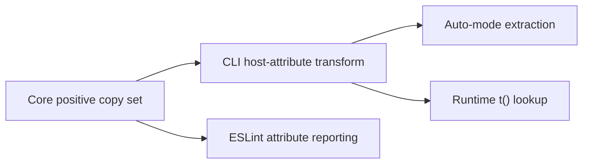

# Safe host-attribute classification

## Decision

Host attributes use positive classification. The compiler translates only names
with a defined user-facing text contract. Unknown names remain structural by
default.

| Category                     | Examples                                                                                       | Auto translate |
| ---------------------------- | ---------------------------------------------------------------------------------------------- | -------------- |
| Visual copy                  | `title`, `placeholder`, `alt`, `label`                                                         | Yes            |
| Accessibility copy           | `aria-label`, `aria-description`, `aria-placeholder`, `aria-roledescription`, `aria-valuetext` | Yes            |
| ARIA behavior and references | `role`, `aria-live`, `aria-describedby`, `aria-controls`, `aria-expanded`                      | No             |
| Form and navigation tokens   | `accept`, `autoComplete`, `href`, `target`, `method`, `inputMode`                              | No             |
| SVG geometry and paint       | `viewBox`, `fill`, `stroke`, `strokeLinecap`, `textAnchor`, `vectorEffect`                     | No             |
| DOM and React structure      | `id`, `className`, `key`, `ref`, `name`, `slot`, `data-*`                                      | No             |
| Unknown or library-defined   | Any unrecognized attribute                                                                     | No             |

## Shared contract



The compiler, extractor, and lint rule must import the same predicate. There is
no fallback that treats an unknown name as copy.

## Before and after

```tsx
// Input
<svg aria-label="Risk gauge" viewBox="0 0 220 126" fill="var(--foreground)">
  <path strokeLinecap="round" vectorEffect="none" />
</svg>

// Safe auto-mode output
<svg aria-label={t("Risk gauge")} viewBox="0 0 220 126" fill="var(--foreground)">
  <path strokeLinecap="round" vectorEffect="none" />
</svg>
```

Only `Risk gauge` becomes a catalog message. Every rendering and behavior token
stays byte-identical.
