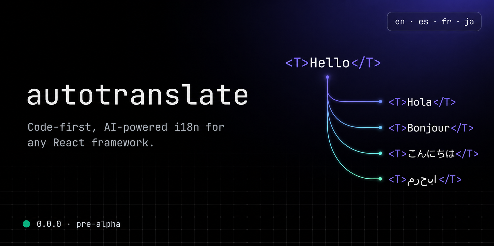

<div align="center">
  <a href="https://github.com/ruwadgroup/autotranslate">
    
  </a>

<br />
<br />

[](LICENSE)
[](tsconfig.base.json)
[](#status)

**Write your app in English. It ships in every language.**

</div>

You write a component the way you always have:

```tsx
<p>Welcome back, {user.name}! You have unread messages.</p>
```

You hit save. Two seconds later the Spanish tab you have open hot-reloads in
Spanish - French and Japanese are done too, and the string is type-checked.

There's no key to invent, no JSON to edit, nothing to wrap. In `mode: 'auto'`
the compiler finds your copy at build time; the AI translates it on your
machine, with your key, and the result lands in your repo as reviewable JSON. If
you'd rather mark strings explicitly, [`<T>`](docs/guides/jsx.md) is the default
mode and always works.

## Get started

```bash
# Next.js
pnpm add @autotranslate/next && pnpm add -D @autotranslate/cli

# Vite
pnpm add @autotranslate/react && pnpm add -D @autotranslate/vite @autotranslate/cli
```

```bash
npx autotranslate init
```

`init` detects your framework and wires everything. Set your
[provider](docs/guides/providers.md) key, `pnpm dev`, write copy.

Five-minute walkthrough: **[Quick start](docs/quick-start.md)**.

## The parts you'd otherwise build yourself

- **Builds are gated.** Production builds fail with the exact list
  (`'Check out' at components/Cart.tsx:41`) when a translation is missing. The
  model is never called at build time, so CI needs no API key.
- **PRs are reviewable.** `autotranslate parity --format github` posts a table
  of every changed translation and fails on missing locales or broken ICU.
- **Your editor knows.** The
  [TypeScript plugin](docs/reference/api.md#autotranslatetypescript-plugin)
  shows the translation inline next to each `t('...')` call.
- **Runtime is boring.** Catalogs bundle through static imports - code-split per
  locale, edge-safe, no filesystem, no runtime AI. Ever.

## Why not the alternatives?

| Library                | Code-as-source | AI translation | Self-hosted | Framework-pluggable |
| ---------------------- | :------------: | :------------: | :---------: | :-----------------: |
| `react-i18next`        |       ❌       |       ❌       |     ✅      |         ✅          |
| `next-intl`            |       ❌       |       ❌       |     ✅      |    Next.js only     |
| `lingui`               |       ✅       |       ❌       |     ✅      |         ✅          |
| `gt-next` / `gt-react` |       ✅       |       ✅       |     ❌      |   Next.js + React   |
| **`autotranslate`**    |       ✅       |       ✅       |     ✅      | ✅ + edge runtimes  |

Traditional i18n hands you a second codebase of keys and catalogs that drifts
from the first. Cloud AI i18n fixes the authoring but takes your copy to a
vendor. autotranslate does neither - the reasoning is in
[Philosophy](docs/philosophy.md).

## Documentation

- **[Quick start](docs/quick-start.md)** - translated app in five minutes
- **[Concepts](docs/concepts.md)** - the mental model on one page
- **[Frameworks](docs/README.md#frameworks)** - Next.js, Vite, Remix
- **[Guides](docs/README.md#guides)** - `<T>`, `useT`, standalone `t()`,
  plurals, formatters, providers, type-safety
- **[Cookbook](docs/README.md#cookbook)** - locale switcher, forms, testing,
  CI/CD, overrides, debugging
- **[Migrating](docs/README.md#migrating)** - from `react-i18next`, `next-intl`,
  `lingui`, `gt-next`
- **[Reference](docs/README.md#reference)** - configuration, CLI, public API

## Examples

```bash
pnpm --filter @autotranslate/example-next-app dev    # Next.js App Router + RSC
pnpm --filter @autotranslate/example-vite-react dev  # Vite + React SPA
```

Both ship with committed catalogs, so they run without an API key.

## Status

**1.0.0-beta** - install with the `beta` dist-tag. GA after a real-world soak.

| Phase    | Versions       | What it means                                                        |
| -------- | -------------- | -------------------------------------------------------------------- |
| Beta     | `1.0.0-beta.x` | Public API frozen modulo bug fixes; on-disk format is additive-only. |
| 1.0      | `1.0.0`        | First stable release. Semver from here on.                           |
| Post-1.0 | `1.x.y+`       | Backwards-compatible features and fixes per semver.                  |

The bar for a breaking change before GA: real production pain the frozen API
can't accommodate. Bug reports, design feedback, and PRs welcome.

## Contributing

```bash
pnpm install && pnpm dev
pnpm test && pnpm typecheck && pnpm lint
```

Internals in [`ARCHITECTURE.md`](ARCHITECTURE.md), workflow in
[`.github/CONTRIBUTING.md`](.github/CONTRIBUTING.md), releases in
[`.github/RELEASING.md`](.github/RELEASING.md).

## License

MIT © [Tamim Bin Hakim](https://github.com/tamimbinhakim) and contributors.
