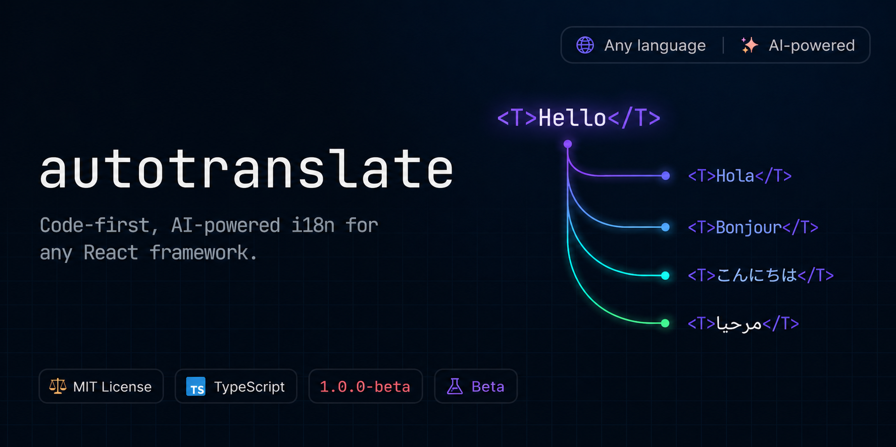

<div align="center">
  <a href="https://github.com/tamimbinhakim/autotranslate">
    
  </a>

<br />
<br />

[](LICENSE)
[](tsconfig.base.json)
[](https://biomejs.dev/)
[](https://pnpm.io/)
[](https://www.conventionalcommits.org)
[](#status)

Write strings the way you write code. Run a command. Get translated catalogs.

</div>

<!-- prettier-ignore -->
> [!NOTE]
> autotranslate is in **1.0.0-beta**. Install with the `beta` dist-tag:
> `pnpm add @autotranslate/core@beta`. The public API surface is frozen modulo
> bug fixes — see [`STABILITY.md`](STABILITY.md). GA after a real-world soak.

```tsx
<T>
  Welcome, <Var>{user.name}</Var>!
</T>
```

```bash
npx autotranslate translate
```

```
.translations/es.json, fr.json, ja.json …
```

## Quick features

- **Code is the source of truth.** Keys derive from your source — string
  literals for `useT`, structural hash for `<T>`. No JSON to hand-author.
- **Bring your own AI.** Vercel AI SDK (Anthropic, OpenAI, Google, OpenRouter)
  plus DeepL and Google Cloud Translation for short copy. Plug in anything via a
  custom provider.
- **Self-hosted by default.** Catalogs are JSON files in your repo. No cloud, no
  CDN, no vendor lock-in.
- **Framework-pluggable.** First-class adapters for Next.js, Vite, Remix, React
  Native, and edge runtimes (Vercel Edge, Cloudflare Workers, Bun).
- **End-to-end type-safe.** Codegen'd locale unions, narrowed `useT` keys, ICU
  param inference. A missing translation is a TypeScript error.
- **Edge-runtime friendly.** No `node:fs` in the runtime path. Synchronous
  translator, RSC-aware, edge-aware.
- **Fast diffs.** SHA-256 + per-(source, target, provider) cache means only
  changed strings hit the model.

## Documentation

Full documentation lives in [`docs/`](docs/):

- **[Overview](docs/overview.md)** — what autotranslate does and where it fits
- **[Quick start](docs/quick-start.md)** — translate your first string in five
  minutes
- **[Concepts](docs/concepts.md)** — catalogs, keys, locales, ICU on one page
- **[Guides](docs/README.md#guides)** — `<T>`, `useT`, standalone `t()`,
  formatters, providers, type-safety, linting
- **[Frameworks](docs/README.md#frameworks)** — Next.js, Vite, Remix
- **[Integrations](docs/integrations/zod.md)** — Zod validation errors
- **[Cookbook](docs/README.md#cookbook)** — locale switcher, form validation,
  server actions, testing, CI/CD, lazy-loading, custom providers, debugging
- **[Reference](docs/README.md#reference)** — configuration, CLI, public API

## Installation

```bash
pnpm add @autotranslate/react @autotranslate/core
pnpm add -D @autotranslate/cli
npx autotranslate init
```

## Quick start

Edit `autotranslate.config.ts`:

```ts
import { defineConfig } from '@autotranslate/core/config';

export default defineConfig({
  source: 'en',
  targets: ['es', 'fr', 'ja'],
  content: ['src/**/*.{ts,tsx}'],
  provider: {
    name: 'ai',
    model: 'anthropic:claude-haiku-4-5',
    apiKey: process.env.ANTHROPIC_API_KEY,
  },
});
```

Wrap your app:

```tsx
import { T, TranslationProvider } from '@autotranslate/react';

export function App() {
  return (
    <TranslationProvider locale="en">
      <T>Hello, world!</T>
    </TranslationProvider>
  );
}
```

Translate:

```bash
npx autotranslate translate
```

The CLI extracts every `<T>` and `useT()` call, writes
`.translations/{locale}.json`, and only translates what changed. See the full
walkthrough in [Getting Started](docs/getting-started.md).

## How it works

```
Source code  →  AST extractor  →  en.json (canonical)
                                       │
                                       ▼
                         Diff vs cache (SHA-256)
                                       │
                                       ▼
                Translation provider (AI / DeepL / custom)
                                       │
                                       ▼
                  .translations/{locale}.json + .meta.json
                                       │
                                       ▼
        Runtime: load on demand (RSC) / bundle in (SPA / RN)
```

For the full design, see [`ARCHITECTURE.md`](ARCHITECTURE.md).

## Why autotranslate?

| Library                | Code-as-source | AI translation | Self-hosted | Framework-pluggable |
| ---------------------- | :------------: | :------------: | :---------: | :-----------------: |
| `react-i18next`        |       ❌       |       ❌       |     ✅      |         ✅          |
| `next-intl`            |       ❌       |       ❌       |     ✅      |    Next.js only     |
| `lingui`               |       ✅       |       ❌       |     ✅      |         ✅          |
| `gt-next` / `gt-react` |       ✅       |       ✅       |     ❌      |   Next.js + React   |
| **`autotranslate`**    |       ✅       |       ✅       |     ✅      | ✅ + edge runtimes  |

## Examples

- [`examples/next-app`](examples/next-app) — Next.js App Router + RSC + proxy
- [`examples/vite-react`](examples/vite-react) — Vite + React SPA

```bash
pnpm --filter @autotranslate/example-next-app dev
pnpm --filter @autotranslate/example-vite-react dev
```

## Status

**1.0.0-beta.** Public API surface frozen modulo bug fixes — see
[`STABILITY.md`](STABILITY.md). GA cuts after a real-world soak.

| Phase    | Versions       | What it means                                       |
| -------- | -------------- | --------------------------------------------------- |
| Beta     | `1.0.0-beta.x` | Public API frozen. Soaking the surface before GA.   |
| 1.0      | `1.0.0`        | First stable release. Semver from here on.          |
| Post-1.0 | `1.x.y+`       | Backwards-compatible features and fixes per semver. |

Install the beta with `pnpm add @autotranslate/core@beta`. Bug reports, design
feedback, and PRs are welcome — the bar for landing breaking changes before GA
is "real production pain that the API can't accommodate."

## Contributing

Run the dev workflow:

```bash
pnpm install
pnpm dev         # turbo run dev across all packages
pnpm test        # vitest across the monorepo
pnpm typecheck   # composite tsc
pnpm lint        # biome check
```

See [`CONTRIBUTING.md`](CONTRIBUTING.md) for the full workflow and
[`.github/RELEASING.md`](.github/RELEASING.md) for the release process.

## License

MIT © [Tamim Bin Hakim](https://github.com/tamimbinhakim) and contributors.
